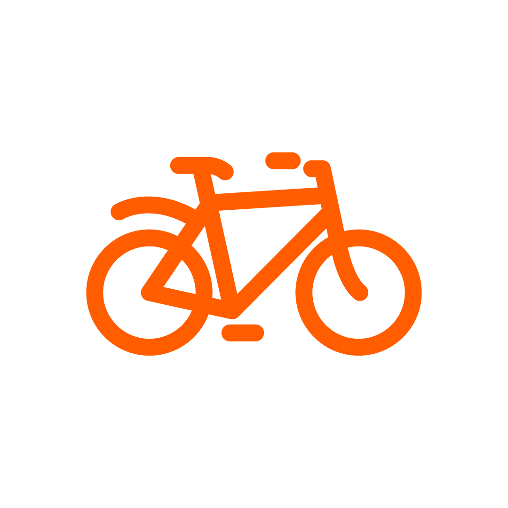
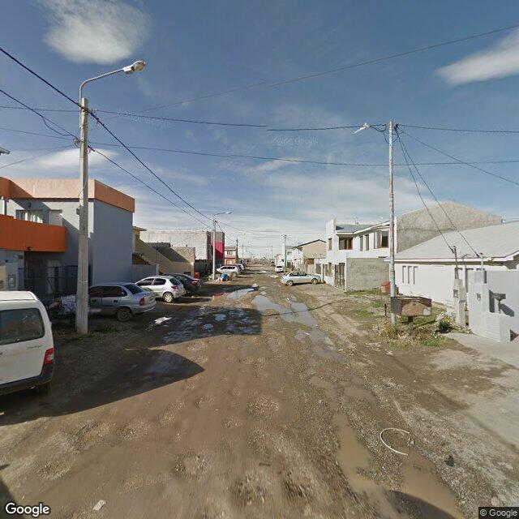
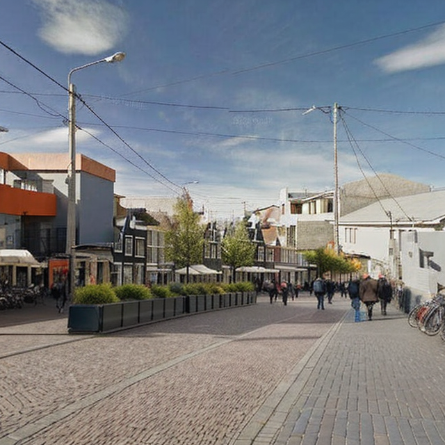
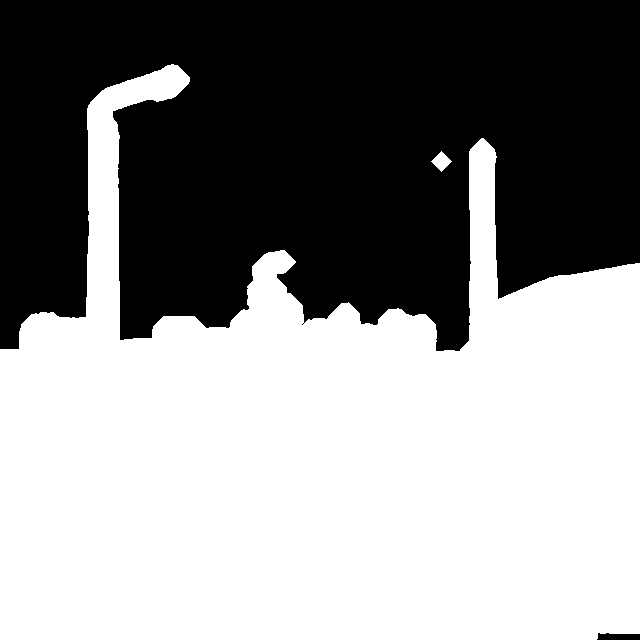

<!-- PROJECT LOGO -->
 

  

  <h3 align="center">Dutch Cycling Lifestyle</h3>

  

    Develop a happier and healthier street with our cycling lifestyle.
     
    <a href="#getting-started"><strong>Explore the docs »</strong></a>
     
     
    <a href="https://www.holland.com/global/tourism/get-inspired/current/cycling-lifestyle.htm">Read more</a>
    ·
    <a href="https://github.com/dutchcyclinglifestyle/dutchcyclinglifestyle/issues">Report Bug</a>
    ·
    <a href="https://github.com/dutchcyclinglifestyle/dutchcyclinglifestyle/issues">Request Feature</a>
  

<!-- TABLE OF CONTENTS -->

  
Table of Contents

  <ol>
    <li>
      <a href="#about-the-project">About The Project</a>
      <ul>
        <li><a href="#background">Background</a></li>
        <li><a href="#built-with">Built With</a></li>
      </ul>
    </li>
    <li>
      <a href="#getting-started">Getting Started</a>
      <ul>
        <li><a href="#prerequisites">Prerequisites</a></li>
        <li><a href="#installation">Installation</a></li>
      </ul>
    </li>
    <li><a href="#usage">Usage</a></li>
    <li><a href="#roadmap">Roadmap</a></li>
    <li><a href="#contributing">Contributing</a></li>
    <li><a href="#license">License</a></li>
    <li><a href="#contact">Contact</a></li>
    <li><a href="#credits">Credits</a></li>
    <li><a href="#acknowledgments">Acknowledgments</a></li>
  </ol>

<!-- ABOUT THE PROJECT -->

## About The Project

### Background

The Dutch cycling lifestyle tool is a project by the Netherlands Board of Tourism & Conventions. The tool is designed to generate images of a happier and healthier street with our cycling lifestyle. The tool is built using a combination of AI and urban planning to create a vision of a future street that's more suitable for cycling.

The tool transforms existing streets into a vision of a future street that's more suitable for cycling. See the example below:

<!-- table with before and after images -->
<table>
  <tr>
    <td>
      <figure>
        
        <figcaption>Before</figcaption>
      </figure>
    </td>
    <td>
      <figure>
        
        <figcaption>After</figcaption>
      </figure>
    </td>
  </tr>
</table>

### Built with

The Dutch cycling lifestyle tool relies mainly on the technology called [Stable Diffusion](https://github.com/CompVis/stable-diffusion). This technology allows us to generate images using text prompts on a model that's trained on a lot of images.

This model also allows us to "inpaint" in a certain area of an existing picture. To determine this area we use a segmentation model that detects the road and vehicles in the original images.

<figure>
  
  <figcaption>Segmentation of unwanted objects</figcaption>
</figure>

All of this is built in a framework especially for the mentioned technology, called [ComfyUI](<[http://](https://github.com/comfyanonymous/ComfyUI)>), which is a visual node-based interface for AI image processing. This framework allows us to easily modify the workflow and add new features.

<!-- GETTING STARTED -->

## Getting Started

### Prerequisites

### Installation

## Usage

## Roadmap

- [x] Start of development (June 2023)
- [x] Launch Dutch cycling lifestyle tool (November 2023)
- [x] One million generated images (January 2024)
- [ ] Open source the tool (February 2024)

## Contributing

This project is open source and we welcome contributions. Report bugs and feature requests using the [issues](https://github.com/dutchcyclinglifestyle/dutchcyclinglifestyle/issues) tab, or request new features by forking the project and creating a pull request.

The best way to contribute is to modify the ComfyUI workflow and add new nodes to the tool and submit a pull request with a new workflow json file in the `workflows` folder. Installs of the added custom nodes, or new models can be added to the `install.sh` script.

<!-- LICENSE -->

## License

Distributed under the MIT License. See LICENSE.txt for more information.

## Contact

  
  

  The Netherlands Board of Tourism & Conventions
   
  <a href="mailto:nbtc@holland.com">nbtc@holland.com</a>
  

<!-- Credits -->

## Credits

This project is developed by [Handpicked Lab](https://www.handpickedagencies.com/lab) (creative technology & backend), [IN10](https://www.in10.nl/) (frontend), [HumanKind](https://www.humankind.city/) (concept & urban planning) and the Netherlands Board of Tourism & Conventions.

Special thanks to the following people for their contributions:

- [Jascha Huisman](https://www.linkedin.com/in/jaschahuisman/)
- [Samet Yilmaz](https://www.linkedin.com/in/samet-yilmaz/)
- [Lior Steinberg](https://www.linkedin.com/in/liorsteinberg/)
- [Frank Kwanten](https://www.linkedin.com/in/frank-kwanten-1239049/)

<!-- ACKNOWLEDGMENTS -->

## Acknowledgments

This tool couldn't have been made without the following open source projects:

- [Stable Diffusion](https://www.github.com/CompVis/stable-diffusion)
- [ComfyUI](https://www.github.com/comfyanonymous/ComfyUI)
- [ComfyUI Segment Anything](https://github.com/storyicon/comfyui_segment_anything.git)
- [Segment Anything](https://segment-anything.com/)
- [Grounded Segment Anything](https://github.com/IDEA-Research/Grounded-Segment-Anything)
- [Grounding DINO](https://github.com/IDEA-Research/GroundingDINO)
